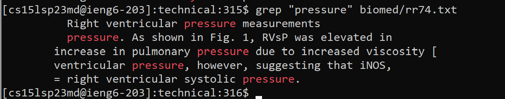
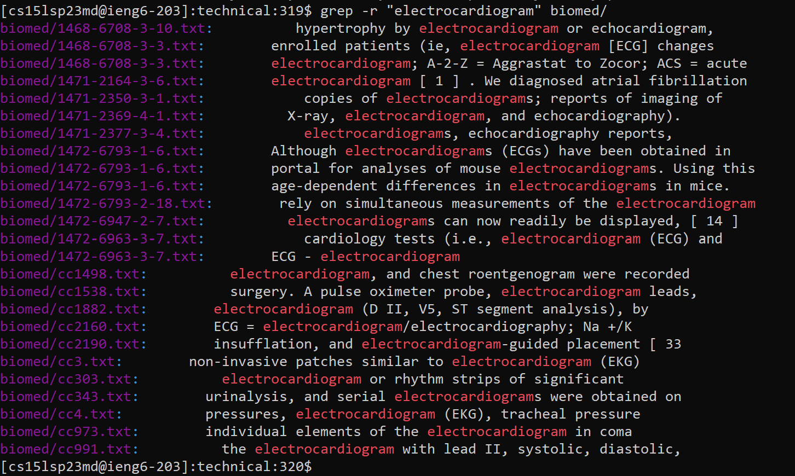
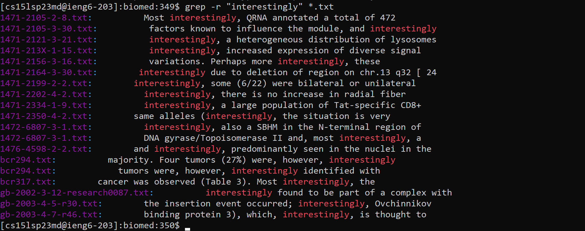
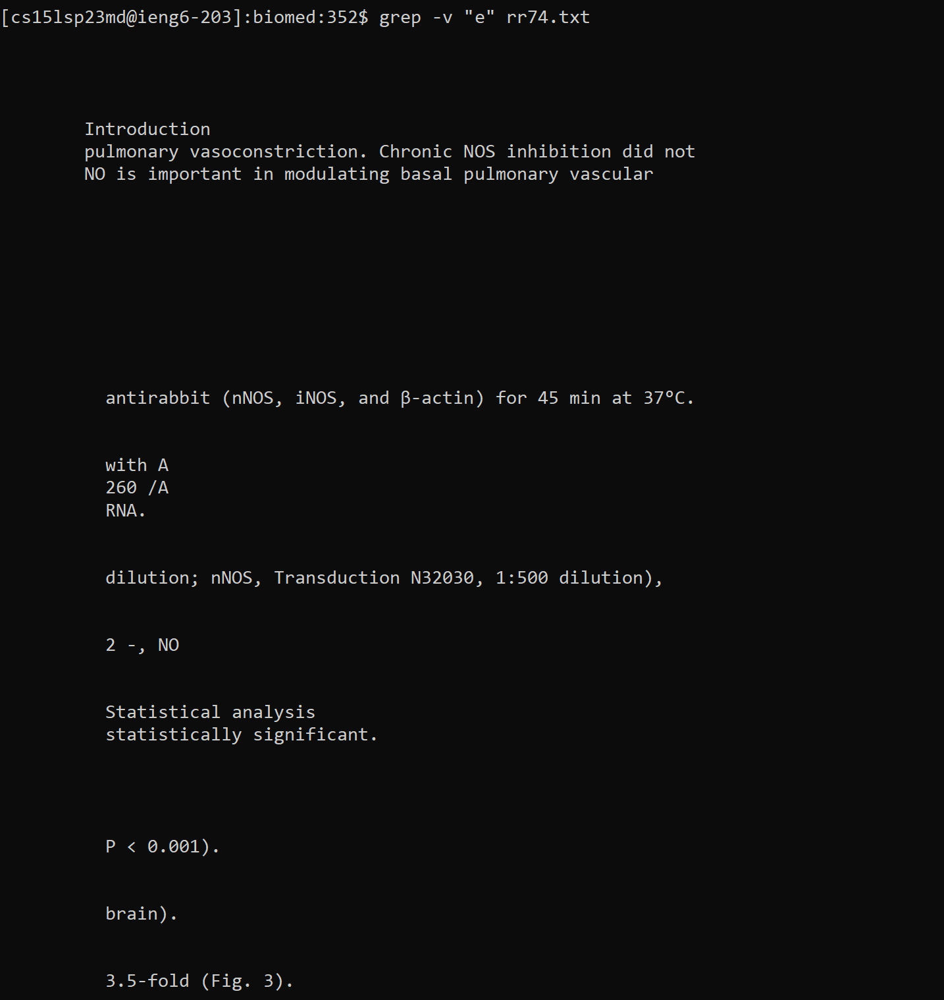
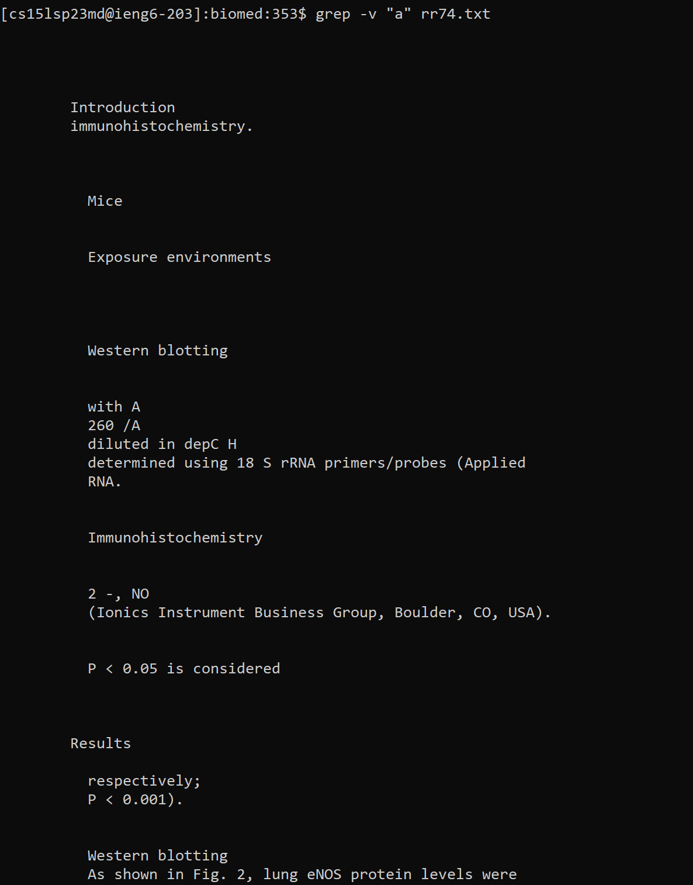
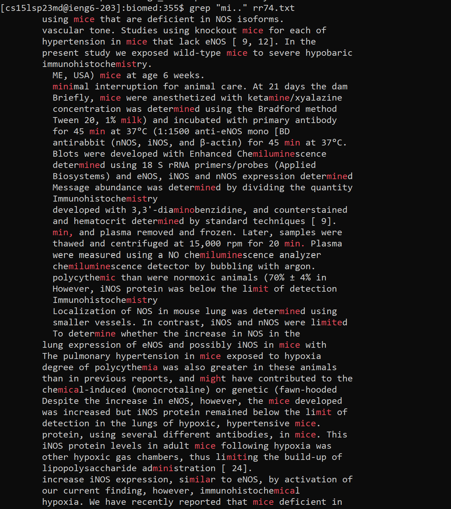
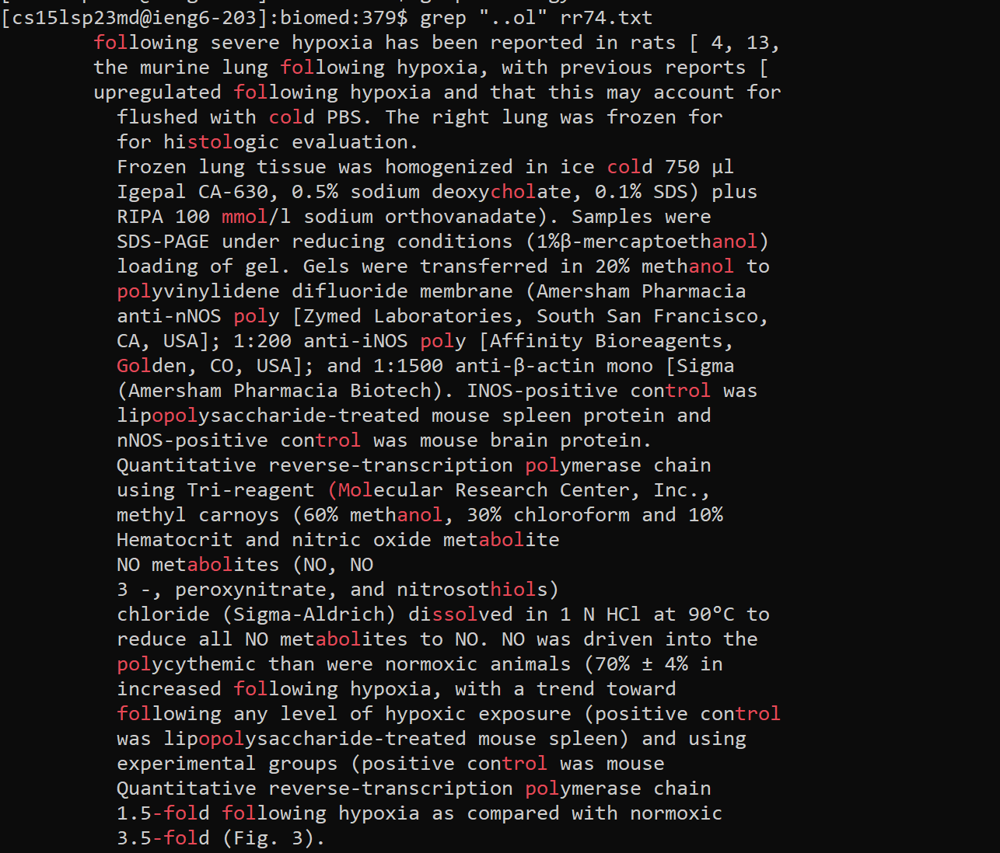
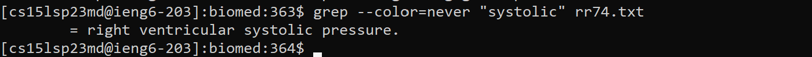

# CSE 15L Lab Report 3
- Today, we'll explore a shell command, `grep`.
- We'll learn some modifications and manipulations to `grep` that can be helpful when search for a certain pattern or string in a file.
- All the information is from the sources at the bottom and my own experience.

## grep Info
- `grep` is a command short for "global regular expression print"
- `grep` is pre-installed in every Linux distribution
- Some distributions automatically give certain settings to grep by using aliases. For example, these aliases are set up:
	- This means that `grep` will search and output with patterns highlighted in color (see examples below)
```shell
alias egrep='egrep --color=auto'
alias fgrep='fgrep --color=auto'
alias grep='grep --color=auto'
```

## grep Syntax
- `grep` takes in a pattern and a file name to search through. It returns the file with the found patterns highlighted (mine is shown in red)
### Basic Syntax
- Basic `grep` syntax
```shell
grep "string to search for" filename
```
- Example:
	- As a reminder, I am using Linux distribution Ubuntu 20.04
	- `pwd` is `technical/`
```shell
grep "pressure" biomed/rr74.txt
```



### Modifications
#### Recursive search
- If you want to search recursively in all files in a certain directory
```shell
grep -r "string" path-pattern
``` 

##### **Example 1**: 
- `pwd` is now `biomed/`
```shell
grep -r "electrocardiogram" *
``` 
- 
- This option is helpful for when you want to search for all files that have a specific string. A doctor may be doing research and wants to collect all the lines in all files that mention "electrocardiogram".

##### **Example 2**:
```shell
grep -r "interestingly" *.txt
```
- 
- This modification is helpful for when you have many files or subdirectories and are needing to search for a certain name or expression. For example, a TA may search for a student's name in all the submitted PA files in order to find that student's specific PA. 

#### Invert Match
- What if you want to find only lines that *don't* match the string specified? You can use the `-v` flag option.
```shell
grep -v "string" filename
```

##### **Example 3**:
```shell
grep -v "e" rr74.txt
```
- 
- This option is helpful for finding every line without an "e". It's possible there are not many lines without it, since it is the most common letter. You can use this fact to explore exactly how often they appear in your files and exactly when they don't.

##### **Example 4**:
```shell
grep -v "a" rr74.txt
```
- 
- Regular expressions are helpful for when you want to exclude certain strings. For example, you can inverse search for `javac` in a bash script to rule out all the potentially repetitive java compile commands.

#### Regular Expressions
- You can also search for sequences of characters or a string that matches a certain pattern by using **REGEX**.
> "The term REGEX is an acronym for **REG**ular **EX**pression. A REGEX is a sequence of characters that is used to match a pattern"
> Digital Ocean
```shell
grep REGEX filename
```

##### **Example 5**:
```shell
grep "mi.." rr74.txt
```
- 
- This option is useful to search for any string that matches the pattern above. The `.` represents any single character, so it will allow the matching of any character in those spaces.

##### **Example 6**:
```shell
grep "..ol" rr74.txt
```
- 
- Regular expressions can be very useful in searching for lines in files. For example, a professor may have a `.txt` file full of file names that captures all the submitted files throughout the quarter. They can use REGEXs to narrow down just the `.java` extensions.

#### Colors
- Right now, we have color always on due to our aliases.
- Syntax:
```shell
grep --color[=WHEN] "string" filename
```
where `WHEN` is `always`, `never`, or `auto`.

##### **Example 7**:
	- If you want to toggle this off, use option `never`
```shell
grep --color=never "systolic" rr74.txt
```
- 
- This option can be useful because sometimes its not necessary to print all the lines with matching strings in color, as it may be unreadable. For example, if you want to search for all lines with "a", the highlights will appear in the middle of words and will be more difficult to read.

##### **Example 8**:
- To ensure `grep` always prints with color, use option `always`
```shell
grep --color=always "systolic" rr74.txt
```
- 
- This option is useful to ensure that your matched output will always be highlighted and apparent.

## Conclusion
- Congrats! Today we learned:
	- How to use `grep`
	- How to use `grep` recursively
	- How to modify which patterns it searches and matches using **regular expressions**
	- How to turn color on or off
	- Some common use cases and why `grep` is so useful

## Sources:
- [Digital Ocean](https://www.digitalocean.com/community/tutorials/grep-command-in-linux-unix)
- Man pages (built-in to Linux distros)
	- To find info at the command line: `man grep`
