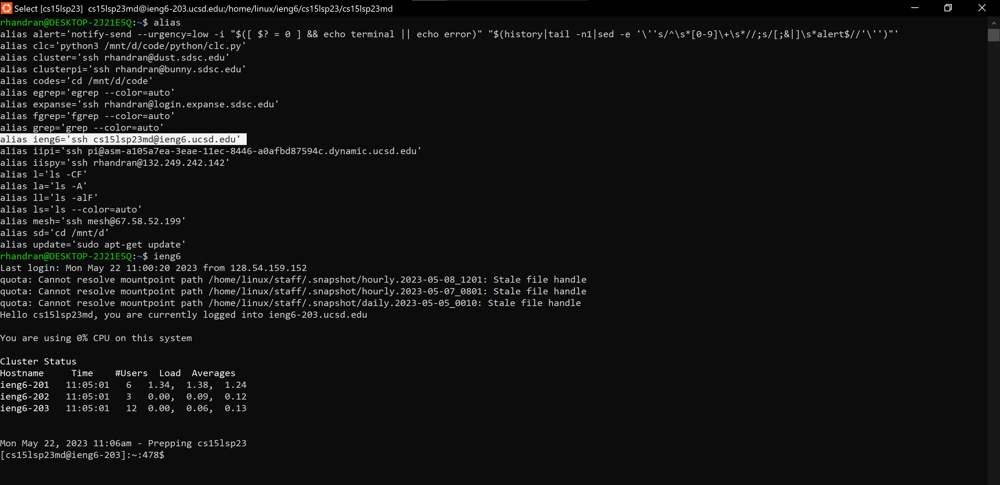
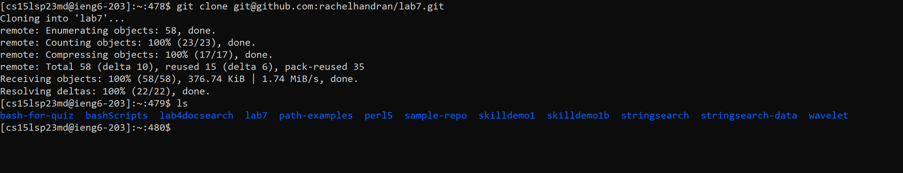
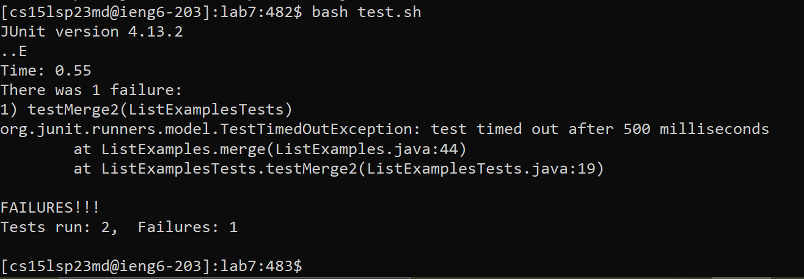
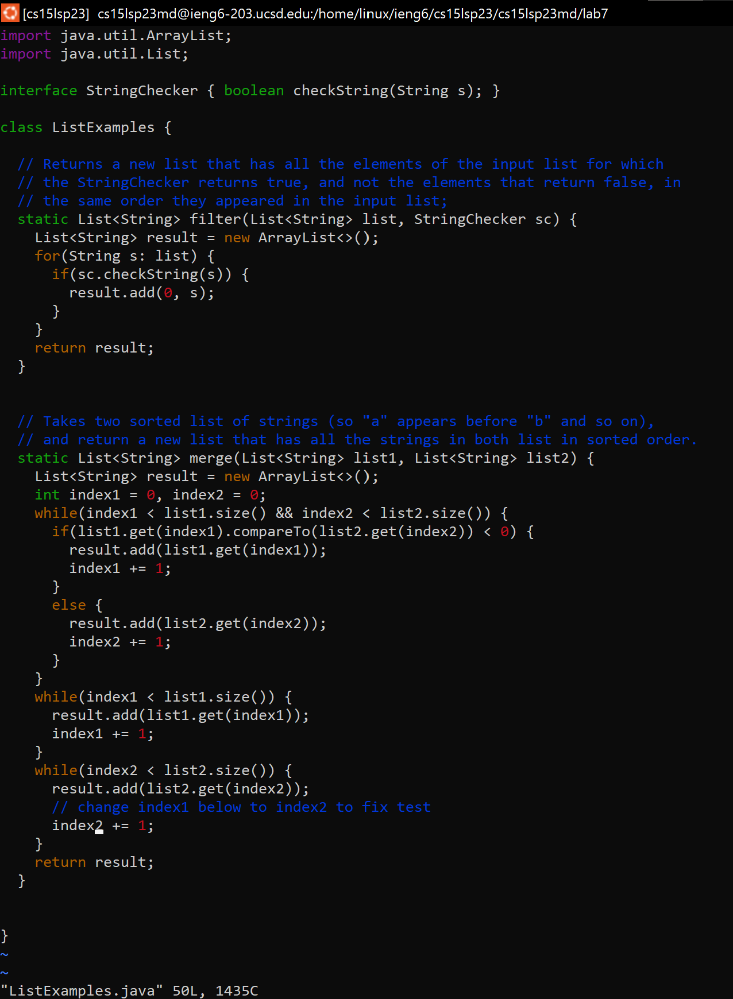
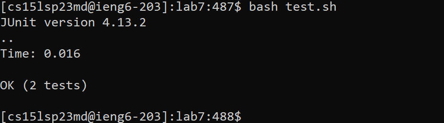
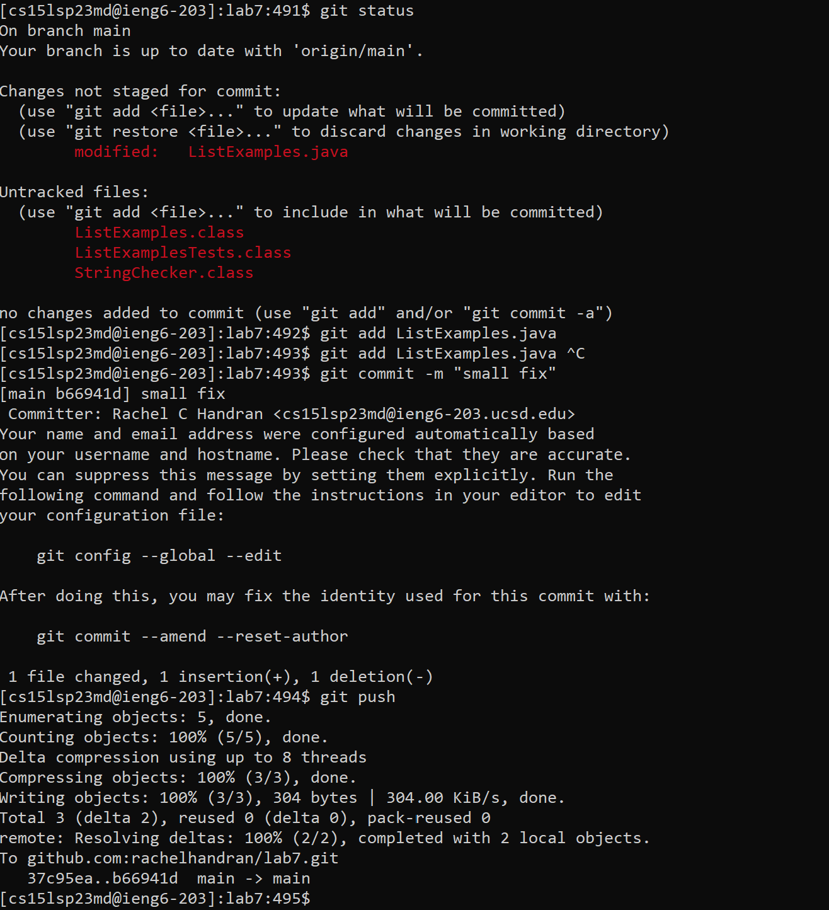

# CSE 15L Lab Report 4
- Today, we're working on everything from the command line!
- We'll follow these instructions from the lab write-up:

> 1.  **Setup** Delete any existing forks of the repository you have on your account
> 2.  **Setup** Fork the repository
> 3.  **The real deal** Start the timer!
> 4.  Log into ieng6
> 5.  Clone your fork of the repository from your Github account
> 6.  Run the tests, demonstrating that they fail
> 7.  Edit the code file to fix the failing test
> 8.  Run the tests, demonstrating that they now succeed
> 9.  Commit and push the resulting change to your Github account (you can pick any commit message!) 

[Lab 4 Write-up](https://ucsd-cse15l-s23.github.io/week/week7/#generating-ssh-keys-for-ieng6)

## Step 4: ssh into ieng6
- `ssh` into `ieng6` with alias: 
###  Keystrokes:
```
ieng6 <enter>
```
- I have an alias for ieng6, as seen in the screenshot, so I just typed ieng6 to ssh into the remote server.


## Step 5: git clone
- git clone forked repo: 
### Keystrokes:
```
git clone <right-click> <enter>
```
- I had copied the ssh link from my github repository to my clipboard, and used right-click to paste it in to the terminal.

## Step 6: Run the failing tests
- Run the tests: 

### Keystrokes:
```
bash te <tab> <enter>
```
- I used tab to autocomplete for finding `test.sh` since it was the only file beginning with the pattern `te`. 

## Step 7: Edit tests to succeed
- Edit with vim 
### Keystrokes:
```
vi Li <tab> . <tab> <enter>
/x1 <enter> <shift-N> e r 2 :wq
```
- I used the shorthand for `vim` which is `vi` (see alias screenshot above) , and used tab automcomplete to find `ListeExamples.java`
- I used `/x1` to search for the text i needed to replace, navigated with `<shift-N>`, skipped to the end of line with `e`, replaced with `r` and `2`, saved and exited with `:wq`.

## Step 8: Run the succeeding tests
- Run the tests to succeed: 

### Keystrokes:
```
bash t <tab> <enter>
```
- I used the same keystrokes as above to re-run the tests.

## Step 9: git add, commit, and push
- git add, commit, push 

### Keystrokes:
```
git status <enter>
git add Li <tab> .j <tab> <enter>
git commit -m "small fix" <enter>
git push <enter>
exit <enter>
```
- In order to push to github, you need to go through a couple steps.
- First, `git add <files>` adds the changed/updated files to the staging area.
- `git commit -m "message"` adds all the files in the stage to a commit 
- `git push` pushes the commit to the final repository. If it is connected to a remote repo, it will push the changes to the remote server (e.g. github.com)
- Finally, `exit` terminates your `ssh` session and returns you to your local machine terminal

## Conclusion
- Congrats, today we learned how to fully use the command line to:
	- Run bash scripts
	- Edit in vim
	- Shorten number of keystrokes with shortcuts like `<tab>` 
	- Add, commit, and push to github from the command line
	- Enter and exit an ssh session
