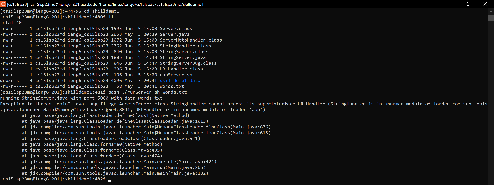
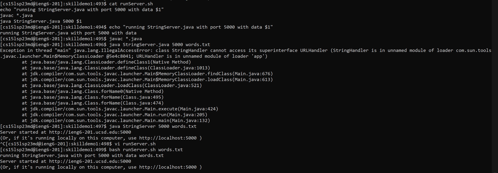
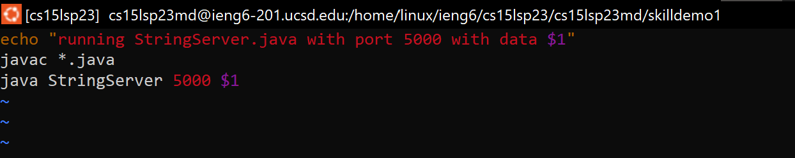

# CSE 15L Lab Report 5
- Today, we'll inspect a bug and the process of solving a programming problem. 
- This bug will involve a **Java** script and a **bash** script.

## Part 1: Debugging Scenario
- Consider this Edstem thread from a student running into some issues with their StringServer code and script. 

### Post 1: Student
*What environment are you using (computer, operating system, web browser, terminal/editor, and so on)?*

Computer: Microsoft Surface Pro 6

OS: Windows/WSL

Terminal: Ubuntu 20.04, ssh session in ieng6

*Detail the symptom you're seeing. Be specific; include both what you're seeing and what you expected to see instead. Screenshots are great, copy-pasted terminal output is also great. Avoid saying “it doesn't work”.*

I am having trouble with getting my StringServer.java code and bash script to run. I am able to compile all the Java files, but once I try to run my bash script runServer.sh, I get this error. I expected the script to start running the StringServer in the web browser with the data "words.txt" on port 5000 of http://ieng6-201.ucsd.edu:5000/ but I got this error instead.

Error:



*Detail the failure-inducing input and context. That might mean any or all of the command you're running, a test case, command-line arguments, working directory, even the last few commands you ran. Do your best to provide as much context as you can.*

The failure-inducing input is the command: bash runServer.sh words.txt

`pwd`: ~/skilldemo1

Bash Script `runServer.sh`: 

```bash
echo "running StringServer.java with port 5000 with data $1"
javac *.java
java StringServer.java 5000 $1
```

Java File `StringServer.java` was taken from the cloned repository from Skill Demo 1.

### Edstem Reply: TA
*Reply: TA Jane Doe*
Take another look at your bash script. Have you tried running each of these commands one by one, to try to break down the script and triangulate the error? 

### Edstem Reply: Student
*Reply: Student Rachel Handran*
I see the problem now! I went line by line through my bash script and found which line caused the error. The `echo` line and `javac` lines were fine, the problem was in the `java` line. It looks like I accidentally left the `.java` file extension in this line. This happened because when I was writing the script in `vim`, I couldn't rely on the Tab autocomplete that would usually stop the argument at `StringServer` without the file extension. Below are screenshots of my terminal commands and my fix to `runServer.java` in `vim`.





```bash
echo "running StringServer.java with port 5000 with data $1"
javac *.java
java StringServer 5000 $1
```

## Part 2: Reflection
One interesting thing I learned through my experience in this the CSE 12 & 15L classes this quarter was the ability to debug using the VS Code debugger. One of the CSE 12 TAs showed me how to use this to help debug a PA, and I have been using it ever since. The debugger allows you to set a breakpoint in your code and step through each line, step into method calls, and keeps track of instance and global variables at each point in time in your code. It was extremely helpful since it allowed me to focus less on memorizing what state each variable my code was in and rather focus on the bigger conceptual issues.

## Conclusion
- Today we reviewed an example of a debugging process and how to narrow down the potential causes by breaking down the problem into small pieces. 
- Another helpful tool to debug is the VS Code debugger, where you can set a breakpoint in your code and step through each line and method. 
- Overall, I've learned many concepts in this lab, including:
	- Utilizing VS Code and the built-in terminal
	- Use of the terminal, command line, navigating filesystems, creating and editing files
	- Writing scripts to streamline running our code (and other people's, like in the autograder!)
	- Using `vim` and editing directly at the command line
	- Learning about version control, `git`, and GitHub
- Thank you Professor Politz and the CSE15L TA/tutor team for a wonderful quarter!
