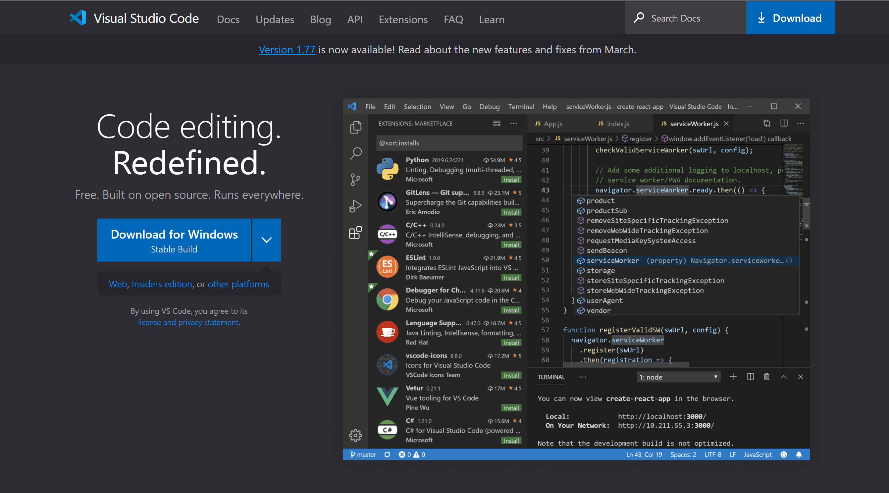
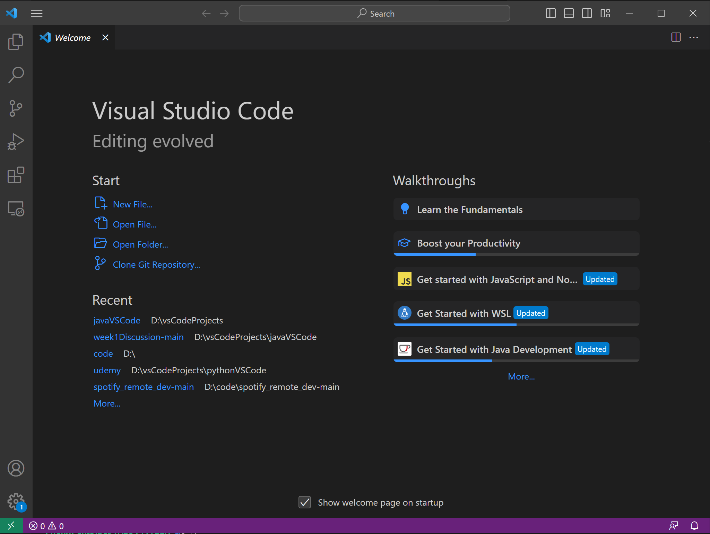
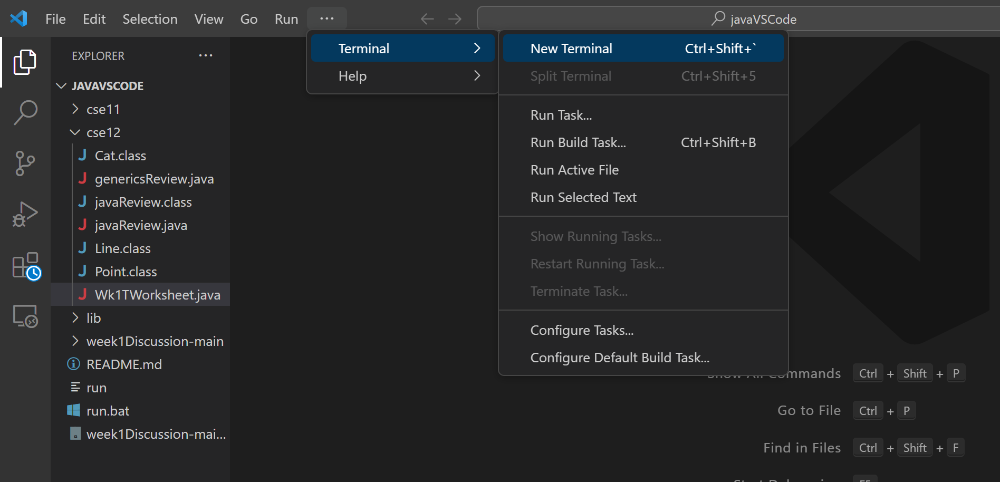
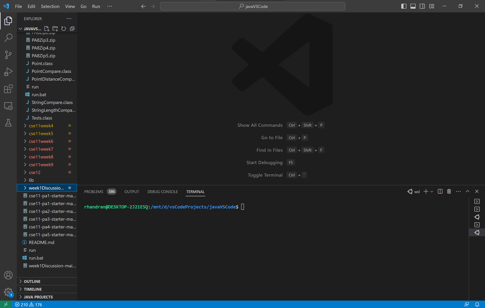
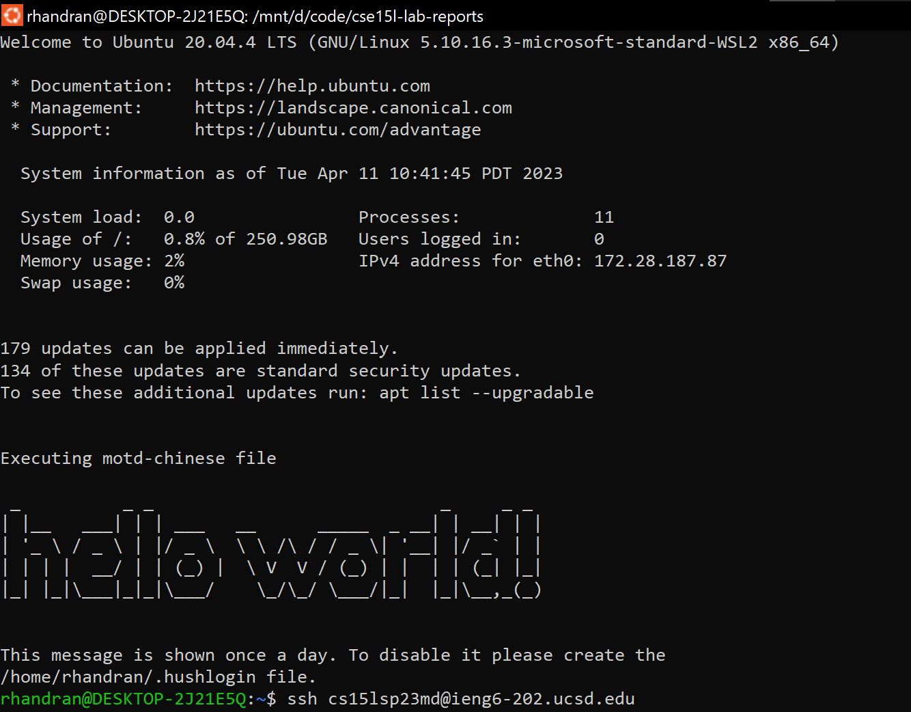
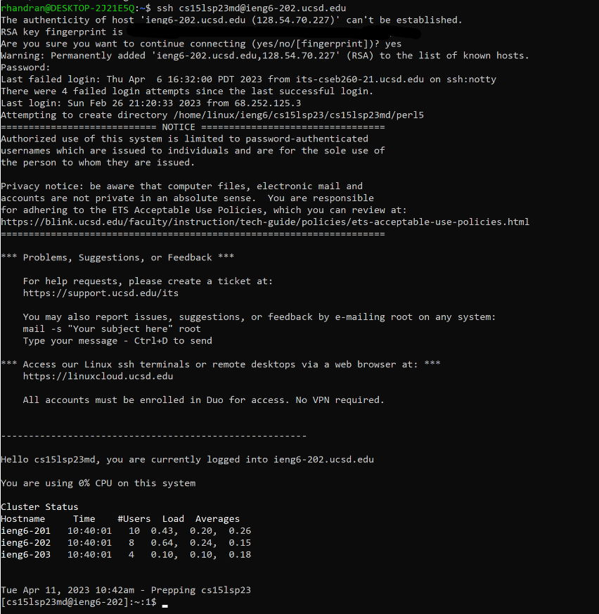
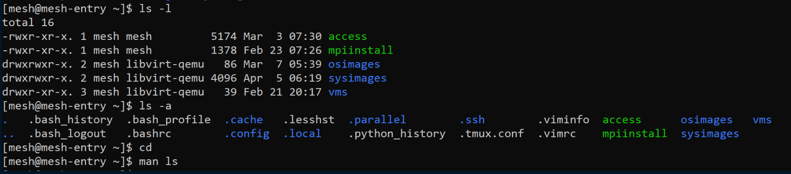
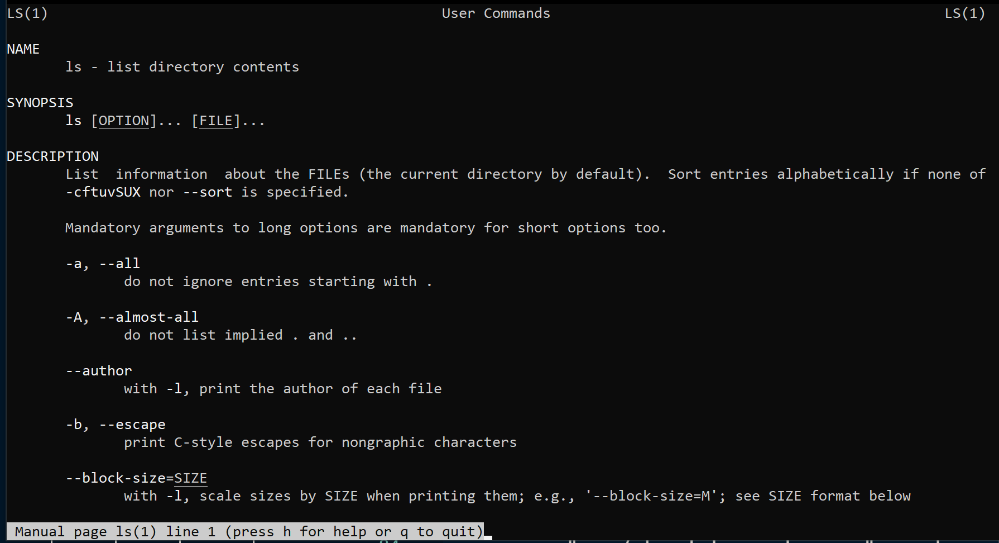
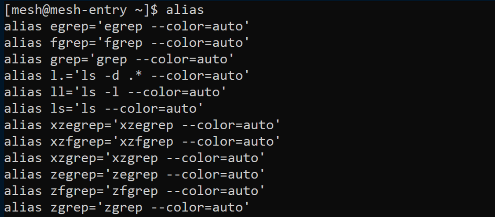

# CSE 15L Lab Report 1
Hello! Welcome to CSE 15L. In order to assist in our experience in CSE 12 and 15L, we will learn to use tools such as the terminal, `git` and version control, and IDEs. These tools and shortcuts will help optimize your programming experience throughout your academic and professional career.

I'll walk through downloading an IDE, securely connecting to a remote server with `ssh`, and using some Unix-based commands in the `shell` scripting language. For reference, I use a Windows machine running the *Windows Subsystem for Linux (WSL)* and by distribution is *Ubuntu 20.04*. 

### 1. Visual Studio Code
#### Install and Download VS Code
- *Visual Studio Code* is an **Integrated Development Environment** (IDE).
- VS Code essentially acts as a text editor with many advanced features and extensions that assist while writing code.
- Install and download VS Code here for your system: [VS Code Download](https://code.visualstudio.com/)



- Once downloaded, open any existing folder as a workspace. Alternatively, you can create new directories and files directly in *VS Code*.
- You can open a new file, program, or script: `<filename>.extension`, for example, `hello.java` or `hello.py`. You can begin writing right away! 
	- VS Code has built-in support for countless programming languages, and you can install them by clicking on the grid icon in the left taskbar.
	- We'll be focusing on first accessing the terminal rather than writing a program now.

#### Open the Terminal
- For our next step, we'll need access to the *shell*, *terminal* or the *Command Line Interface (CLI)*
- In Operating Systems, the *shell* is the UI exposed to the user, that allows them to interact with the computer's filesystem, programs, and more.
- At the top task bar, open the *Terminal* tab, then select *New Terminal*.

- A terminal will open at the bottom. Depending on your machine, it may be *Powershell/Windows*, *Mac*, *Linux*. 
- We will be using the `shell` *scripting language*. Some shell examples:
	- `bash`: "bourne-again shell"
	- `zsh`: zshell

- You can also access your terminal directly on your computer. I use the distribution Ubuntu 20.02 for WSL.
	- Here's my customized message of the day and interface (yours will look different!):
	


### 2. Connect to the Remote Server with ssh 
- `ssh` stands for "secure shell"
- With `ssh` we can securely connect to a remote server and use its terminal as if we are physically on that machine. Our local machine is the *client* and the host is the *server*.
```bash
ssh <hostname@host>
```
- In our case, the *client* is your local personal computer, and the *server* is a machine in the CSE basement. As students in CSE15L, we are each given accounts to use for the class. 
	- To find your specific account: [CSE 15L Account Lookup](https://sdacs.ucsd.edu/~icc/index.php)
- Log in by `ssh`: 
```shell
ssh <your-account-name>@ieng6.ucsd.edu
```
- Enter your password that you just set, and you should be logged in!
- *Note (4.6.23): I was not able to log into my personal ieng6 account yet. I have told the TAs and they are working to figure it out with ETS. Here is an example of using ssh to log in to a mesh network*:

```shell
rhandran@DESKTOP-2J21E5Q$ ssh mesh@67.58.52.199
Activate the web console with: systemctl enable --now cockpit.socket

Last login: Wed Apr  5 07:01:11 2023 from 76.176.152.103
[mesh@mesh-entry ~]$ ls
access  mpiinstall  osimages  sysimages  vms
```
- *Note (4.11.23): I have logged into the ieng6 account using ssh directly into the machines.*


- Now, we'll move on to using the terminal to interact with the filesystem and computer.

### 3. Use the Command Line
- We will use a Unix-based command line. This language is called `shell`, a scripting language.
- The shell will begin with `$`. This indicates where to begin typing your commands.
- Once you've logged into your CSE15L account through `ssh` on the `ieng6` server, try some commands!
```shell
$ ls
```
- Lists the contents of the directory listed as a command-line arg, or current working directory if no args given
```shell
$ ls -l
$ ls -a
```
- Variations of ls, showing in long form:  `ls -l`, and displaying the hidden files: `ls -a`
```shell
$ cd
$ man ls
```
- `cd` takes you to your home directory
- `man ls` shows the manual page for the command which is passed as a command-line arg
	- *Note: Press q to quit man pages.*
	- *Tip: If you're ever stuck in a screen, these usually work to get you back to the terminal:*
		- `Esc`, `q`, `Ctrl+C`, `:wq` (this one we'll learn about later, to get out of `vim`, a text editor)
- My examples:


- *Tip: I use aliases to help streamline my terminal experience. Essentially, you can create a short command or word that can alias for a long command. Try running* `alias` *to see the built-in ones. My most commonly used one is* `ll` *which is short for* `ls -l`.


## Conclusion
- Congratulations! This week, we've learned how to:
	- Download and use an IDE, *VS Code*
	- Find our CSE15L accounts and log in with `ssh`
	- Begin using some basic Unix/shell commands