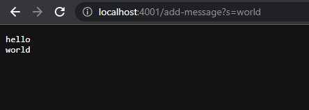

# CSE 15L Lab Report 2
## Part 1: Servers
- Today we'll learn how to set up a server on your local machine.
- Below is a program that sets up a server on your machine, takes in requests using the path `/add-message` and query `?s=<your-msg>`. `your-msg` is added to the string with a newline and is sent as output to the server.

`StringServer.java`
```java
/**
*   Source: NumberServer.java from wavelet repo, 
*   Lab 2 code. Fully based on that program.
*/
import java.io.IOException;
import java.net.URI;

class Handler implements URLHandler {
    String str = "";
  
    public String handleRequest(URI url) {
        if (url.getPath().equals("/")) {
            return String.format("String: %s", str);
        } else {
            System.out.println("Path: " + url.getPath());
            if (url.getPath().contains("/add-message")) {
                String[] parameters = url.getQuery().split("=");
                if (parameters[0].equals("s")) {
                    str = str + "\n" + parameters[1];
                    return String.format("String: %s", str);
                }
            }
            return "404 Not Found!";
        }
    }
}

class StringServer {
    public static void main(String[] args) throws IOException {
        if(args.length == 0){
            System.out.println("Missing port number! Try any number between 1024 to 49151");
            return;
        }

        int port = Integer.parseInt(args[0]);
        Server.start(port, new Handler());
    }
}
```

**Demonstration:**
- To execute the program, run this command:
```shell
javac *Server.java
java NumberServer 4001
```
- Navigate to `http://localhost:4001/` on your web browser.
- To add a message to the string, add to the path: `/add-message?s=<your-msg>`
	- For example: `http://localhost:4001/add-message?s=hello` and
	- `http://localhost:4001/add-message?s=hello` (Output below)
	- 
- Methods called: `handleRequest()`
- Arguments: `handleRequest(localhost:4001)`
- Fields: 
	- `str = "hello\n"`
	- `url = https://localhost:4001`
	- 
- Methods called: `handleRequest()`
- Arguments: `handleRequest(localhost:4001)`
- Fields:
	- `str = "hello\nworld\n"`
		- This value changes because I added a new `add-message` request
	- `url = https://localhost:4001` 
		- This value did not change because the url stays consistent throughout the server session.
- Now you know how to begin and host a server and handle basic requests! 

Next, we'll learn about software bugs. Debugging is a valuable skill for computer scientists to learn, and is arguable the most important skill to learn for your career.

## Part 2: Bugs
- Bugs are faulty parts in code that produce failures, whether in compile time or runtime. Bugs can be detected using print statements, but we prefer using tests to ensure we account for all methods and parts of our program.
- JUnit Tests are a great way of testing code. 
- Example of buggy program, input, and output below.

**Successful JUnit Test:**
`ArrayTests.java`
```java
@Test
public void testReversed() {
	int[] input1 = {3};
	assertArrayEquals(new int[]{3}, ArrayExamples.reversed(input1));
}
```
- This test passes because it only tests for an array of length 1. Although the program is buggy, all arrays of length 1 pass since the bug happens to create the successfull output in this case.

**Failure-Inducing Input:**
`ArrayTests.java`
```java
@Test
public void testReverseInPlace2() {
	int[] input1 = {3, 2, 1};
	assertArrayEquals(new int[]{1, 2, 3}, ArrayExamples.reverseInPlace(input1));
}
@Test
public void testReversed2() {
	int[] input1 = {3, 2, 1};
	assertArrayEquals(new int[]{1, 2, 3}, ArrayExamples.reversed(input1));
}
```
**Ouput:**


**Program:**
`ArrayExamples.java`
```java
static int[] reversed(int[] arr) {
	// Creates a new empty array of matching length
	int[] newArray = new int[arr.length]; 
	// Loops through each index of the original array
	for(int i = 0; i < arr.length; i += 1) {
		// BUG: Assigns arbitrary empty values to the original array "in reverse"
		arr[i] = newArray[arr.length - i - 1]; 
	}
	// Returns empty array that has been overwritten
	return arr;
}
```

**Bug:**
- The bug is in line 4. 
- The intention of this code is to reverse the input array.
- Currently, the code simply creates a new empty array of matching length to the original array.
- It then assigns the original array to the new array values, and returns `arr`. This does not give the desired output.

**Fix:**
- Instead of overwriting the original array, write the opposite array indices to the new array.
`ArrayExamples.java`
```java
  static int[] reversed(int[] arr) {
	// Create a new array with matching length
	int[] newArray = new int[arr.length];
	// Loop through the array
	for(int i = 0; i < arr.length; i += 1) {
		// Write the opposite index to the new array
	    newArray[i] = arr[arr.length - i - 1];
	}
	// Return the new array
	return newArray;
}
```
- How do we debug efficiently?
	- When debugging, it's most important to remember to keep a patient and positive approach. 
	- Write extensive tests.
	- Use the "debugging duck" method - explain your code line by line to a rubber duck. the idea is, if you can explain it, you can understand each line, its purpose, and its intended output.
	- Call the methods and step through your code line by line.

## Part 3: Learning from Week 2 and 3
- One lesson I learned recently was how to manipulate values such as an integer or string stored in a server on our local machine. I learned how to break down the parts of a URL, Uniform Resource Locator, including the **domain**, **path**, **query**, and the **anchor**.
	- **Domain:** The segment of url ending in (.com, .gov, etc) where the website is hosted
	- **Path:** The part after the domain, beginning with `/`, and before arguments, that specifies within the website the specific page is located
	- **Query:** Additional arguments that can act as commands or search requests, a url can process the inputs of these queries and use their values for some purpose
	- **Anchor:** The end of the url which specifies the literal scrolling location on the page

## Conclusion
- Congratulations! In this lab, we learned:
	- How to host servers on our local machine 
	- How to write a Java program to program the server with a specific purpose
	- How to detect bugs and how to fix them
	- The parts of a URL and each part's purpose